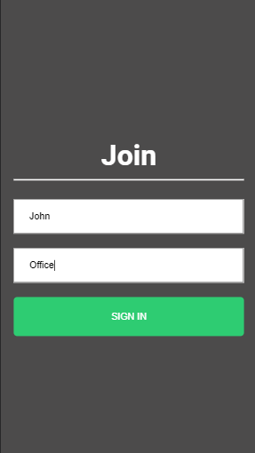

# Chat-App

This repository consists of a real time chat application developed using Socket.IO.It allows users to join into groups and communicate between them by providing a common chat room name and make conversation in realtime.

## Technology Used

- React
- Node Js
- Socket.IO

## Preview

## Author

Gokul R
